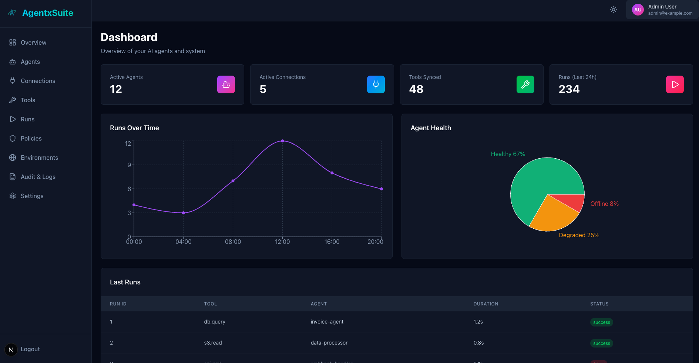

# 🧠 AgentxSuite

AgentxSuite is an open-source platform to connect, manage, and monitor AI Agents and Tools across multiple MCP servers — all in one unified interface.



## 🚀 Overview

AgentxSuite provides a consistent control layer for distributed AI agents.

It connects Agents, Tools, and Policies under a single orchestration system, built for secure, multi-tenant, and MCP-compatible environments.

## 🧩 Tech Stack

| Component | Technology |
|-----------|------------|
| Backend | Django 5.2+, Django REST Framework 3.15+ |
| MCP Service | FastAPI 0.104+ (MCP Fabric Layer) |
| Database | PostgreSQL (production) / SQLite (development) |
| Language | Python 3.11+ |

### backend/

```
  config/              # Django project configuration
  apps/
    accounts/          # User model & auth
    tenants/           # Organizations & Environments
    connections/       # MCP server connections
    agents/            # Agent definitions
    tools/             # Tool registry
    runs/              # Run orchestration
    policies/          # Access policies
    audit/             # Audit events (stub)
  libs/
    secretstore/       # Secret storage abstraction
    permissions/       # RBAC utilities
  mcp_fabric/          # FastAPI MCP-compatible service
    routers/           # Manifest, tools, and run endpoints
    tests/             # Unit & integration tests
  requirements/        # Dependencies (base, dev, test)
```

## ⚙️ Setup

### Option 1: Docker (Recommended)

The easiest way to get started is using Docker Compose:

**1. Create environment file (optional):**
```bash
cp .env.example .env
# Edit .env with your settings (SECRET_KEY, database passwords, etc.)
```

**2. Start all services:**
```bash
docker-compose up -d
```

This will start:
- PostgreSQL database (port 5432)
- Redis cache (port 6379)
- Django API (port 8000)
- Next.js Frontend (port 3000)

**3. Run migrations:**
```bash
docker-compose exec backend python manage.py migrate
```

**4. Create superuser:**
```bash
docker-compose exec backend python manage.py createsuperuser
```

**5. Start MCP Fabric service (optional):**
```bash
docker-compose --profile mcp-fabric up -d mcp-fabric
```

**6. View logs:**
```bash
docker-compose logs -f backend
docker-compose logs -f frontend
docker-compose logs -f mcp-fabric
```

**7. Stop services:**
```bash
docker-compose down
```

**Environment Variables:**
- `SECRET_KEY` - Django secret key (required)
- `POSTGRES_DB`, `POSTGRES_USER`, `POSTGRES_PASSWORD` - Database credentials
- `SECRETSTORE_FERNET_KEY` - Fernet key for secret encryption
- `CORS_ALLOWED_ORIGINS` - Allowed CORS origins
- `NEXT_PUBLIC_API_URL` - Frontend API URL
- `NEXT_PUBLIC_MCP_FABRIC_URL` - Frontend MCP Fabric URL

### Option 2: Local Development

**1. Create a virtual environment**

```bash
python3 -m venv venv
source venv/bin/activate  # On Windows: venv\Scripts\activate
```

**2. Install dependencies**

```bash
cd backend
pip install -r requirements/base.txt
pip install -r requirements/dev.txt
pip install -r requirements/test.txt
```

**3. Apply migrations**

```bash
python manage.py migrate
```

**4. (Optional) Create a superuser**

```bash
python manage.py createsuperuser
```

**5. Start the servers**

**Important:** Make sure the virtual environment is activated (`source venv/bin/activate`)

**Django API**
```bash
cd backend
python manage.py runserver
```

**MCP Fabric (FastAPI)**
```bash
cd backend
uvicorn mcp_fabric.main:app --reload --port 8090
```

**Start both servers simultaneously:**
```bash
cd backend
# Terminal 1: Django
python manage.py runserver

# Terminal 2: MCP Fabric (in new terminal, venv must be activated!)
source ../venv/bin/activate  # If not already activated
uvicorn mcp_fabric.main:app --reload --port 8090
```

**Alternative: Use Makefile**
```bash
# Django API
make run

# MCP Fabric
make run-mcp-fabric
```

## 🔑 Authentication

| Endpoint | Method | Description |
|----------|--------|-------------|
| `/api/v1/auth/register/` | POST | Register new user |
| `/api/v1/auth/login/` | POST | Login and get token |
| `/api/v1/auth/logout/` | POST | Logout current user |
| `/api/v1/auth/me/` | GET | Get current user info |

**Header:**
```
Authorization: Token <your-token>
```

## 🧱 Core Endpoints

### Organizations & Environments

- `GET  /api/v1/orgs/`
- `POST /api/v1/orgs/`
- `GET  /api/v1/orgs/:org_id/environments/`
- `POST /api/v1/orgs/:org_id/environments/`

### Connections

- `GET  /api/v1/orgs/:org_id/connections/`
- `POST /api/v1/orgs/:org_id/connections/`
- `POST /api/v1/connections/:id/test/`
- `POST /api/v1/connections/:id/sync/`

### Agents, Tools & Runs

- `GET  /api/v1/orgs/:org_id/agents/`
- `POST /api/v1/orgs/:org_id/agents/`
- `GET  /api/v1/orgs/:org_id/tools/`
- `POST /api/v1/orgs/:org_id/tools/`
- `POST /api/v1/orgs/:org_id/runs/execute/` - **Unified tool execution endpoint** (recommended)
- `POST /api/v1/tools/:id/run/` - Legacy endpoint (deprecated, use `/runs/execute/` instead)
- `GET  /api/v1/orgs/:org_id/runs/`

#### Unified Run API

The unified run endpoint (`POST /api/v1/orgs/:org_id/runs/execute/`) provides a consistent way to execute tools:

**Request:**
```json
{
  "tool": "uuid-or-name",      // Tool UUID or name
  "agent": "uuid",              // Optional if Agent-Token is used
  "input": {...},               // Input data
  "environment": "uuid",        // Optional, derived from tool if not provided
  "timeout_seconds": 30         // Optional timeout
}
```

**Response (MCP-compatible format):**
```json
{
  "run_id": "uuid",
  "status": "succeeded",
  "content": [{"type": "text", "text": "..."}],
  "isError": false,
  "agent": {"id": "...", "name": "..."},
  "tool": {"id": "...", "name": "..."},
  "execution": {
    "started_at": "2025-01-01T12:00:00Z",
    "ended_at": "2025-01-01T12:00:02Z",
    "duration_ms": 2000
  }
}
```

**Agent Selection:**
- If using an Agent Token: Agent is automatically extracted from token (highest priority)
- If no Agent Token: `agent` field in request is required (no automatic fallback)
- For security reasons, automatic agent selection is not allowed

## 🧬 MCP Fabric (FastAPI Service)

MCP Fabric exposes standardized MCP endpoints to access tools from connected environments. It supports both multi-tenant URL-based routing and JWT token-based authentication.

### Endpoints

**Multi-tenant endpoints (org/env in URL path):**
| Endpoint | Method | Description |
|----------|--------|-------------|
| `/mcp/{org_id}/{env_id}/.well-known/mcp/manifest.json` | GET | Get MCP manifest |
| `/mcp/{org_id}/{env_id}/.well-known/mcp/tools` | GET | List registered tools |
| `/mcp/{org_id}/{env_id}/.well-known/mcp/run` | POST | Execute a tool |

**Root endpoints (org/env extracted from JWT token):**
| Endpoint | Method | Description |
|----------|--------|-------------|
| `/.well-known/mcp/manifest.json` | GET | Get MCP manifest (org/env from token) |
| `/.well-known/mcp/tools` | GET | List registered tools (org/env from token) |
| `/.well-known/mcp/run` | POST | Execute a tool (org/env from token) |

**Authentication:**
```
Authorization: Bearer <JWT-token>
```

JWT tokens must include `org_id` and `env_id` claims for root endpoints.

### Connection Types

MCP Fabric supports three types of connections:

1. **System Tools** (`agentxsuite://system`)
   - Internal system tools (e.g., `agentxsuite_list_runs`, `agentxsuite_create_agent`)
   - Executed directly via handler functions (no HTTP calls)
   - Tools are fetched from database

2. **Own MCP Fabric** (`http://localhost:8090` or configured MCP Fabric URL)
   - Points to the same MCP Fabric service
   - Tools are fetched directly from database (bypasses HTTP)
   - Used for internal tool execution

3. **External MCP Servers** (any other HTTP endpoint)
   - Standard MCP-compatible servers
   - Tools are fetched via HTTP (manifest endpoints or defaults)
   - Full validation and health checks

### Architecture Highlights

- **fastmcp** — Embedded MCP server for manifest, tools, and run endpoints
- **registry.py** — Dynamically registers Django tools with fastmcp, supports direct database queries
- **adapters.py** — Bridges FastAPI tool handlers to Django services
- **Security Layer** — Policy checks, JSON schema validation, rate limiting, timeouts, and audit logging
- **Strategy Pattern** — Endpoint type detection (SYSTEM, OWN_MCP_FABRIC, EXTERNAL_MCP) for optimal routing

## 🧪 Testing

**Run all tests:**
```bash
pytest
```

**With coverage:**
```bash
pytest --cov=apps --cov=libs --cov-report=term-missing
```

**Run specific test:**
```bash
pytest apps/policies/tests/unit/test_policies_allow_deny.py
```

**Local test setup (with mock MCP server):**
```bash
python manage.py seed_local_agentsuite
bash dev/run_servers.sh
```

## 🧹 Code Quality

```bash
ruff check .
ruff format .
mypy apps libs
```

**Or via Makefile:**
```bash
make install
make lint
make typecheck
make test
```

## 🔐 Policies & Access Control

AgentxSuite uses a **default-deny** policy model with explicit allow rules.

### Policy Rules

Policies support both exact matches and **wildcard patterns** using Unix shell-style matching (`fnmatch`):

**Examples:**
```json
{
  "allow": ["agentxsuite_*", "custom_special_tool"],
  "deny": ["dangerous_*", "*_delete_all"]
}
```

**Wildcard Patterns:**
- `agentxsuite_*` - Matches all system tools (e.g., `agentxsuite_list_runs`, `agentxsuite_create_agent`)
- `*_delete` - Matches tools ending with `_delete` (e.g., `user_delete`, `tool_delete`)
- `tool-*` - Matches tools starting with `tool-` (e.g., `tool-123`, `tool-test`)
- `*` - Matches all tools (use with caution)

**Policy Evaluation:**
1. **Deny list checked first** (most restrictive)
2. **Allow list checked second** (explicit permission)
3. **Default deny** if no explicit allow

**Policy Scope:**
- Policies can be organization-wide or environment-specific
- Environment-specific policies override organization-wide policies
- Multiple policies are evaluated in order

### System Tools

AgentxSuite includes built-in system tools for management:

- `agentxsuite_list_runs` - List all runs for an environment
- `agentxsuite_create_agent` - Create a new agent
- `agentxsuite_get_agent` - Get agent details
- `agentxsuite_list_agents` - List all agents
- `agentxsuite_list_connections` - List all connections
- `agentxsuite_list_tools` - List all tools

System tools are accessed via the special connection endpoint: `agentxsuite://system`

## 🌟 Features

- **Multi-tenant architecture** - Organizations & Environments with complete isolation
- **Policy-based access control** - Wildcard support, default-deny model, environment-specific rules
- **System Tools** - Built-in management tools for agents, runs, connections, and tools
- **MCP-compatible FastAPI gateway** - Standard MCP endpoints with JWT authentication
- **Connection Types** - Support for system tools, own MCP Fabric, and external MCP servers
- **Tool Execution Results** - MCP-formatted responses with run_id, duration, and content
- **SecretStore** - Fernet encryption for secrets, never stored in plaintext
- **Service-layer architecture** - Clean separation of concerns, business logic in services
- **High test coverage** - Comprehensive test suite with pytest
- **Strict type checking** - Full mypy support for type safety

## 📄 License

Licensed under AGPL-3.0.

See [LICENSE](LICENSE) for details.
