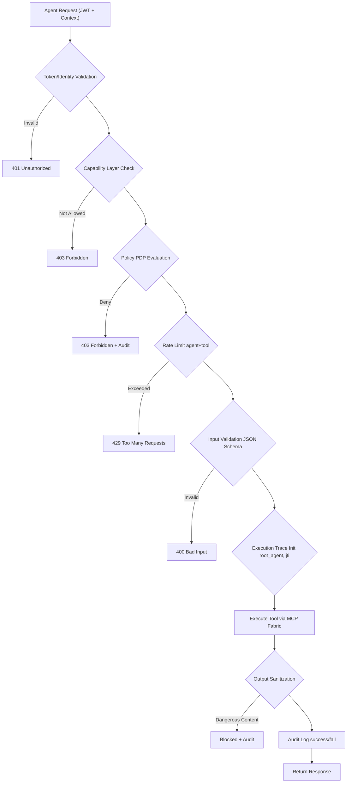
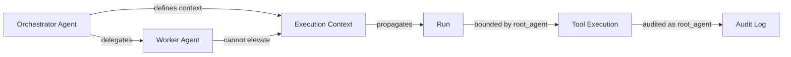
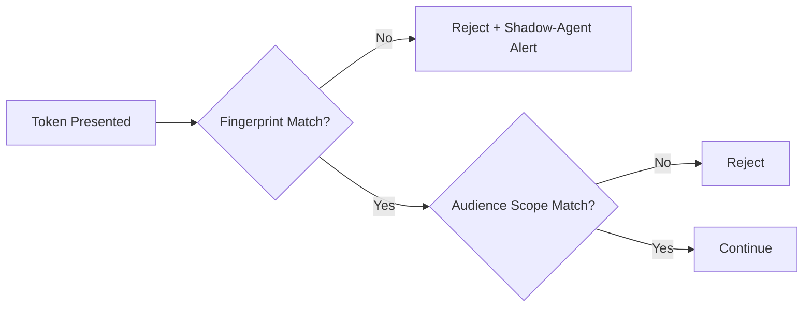
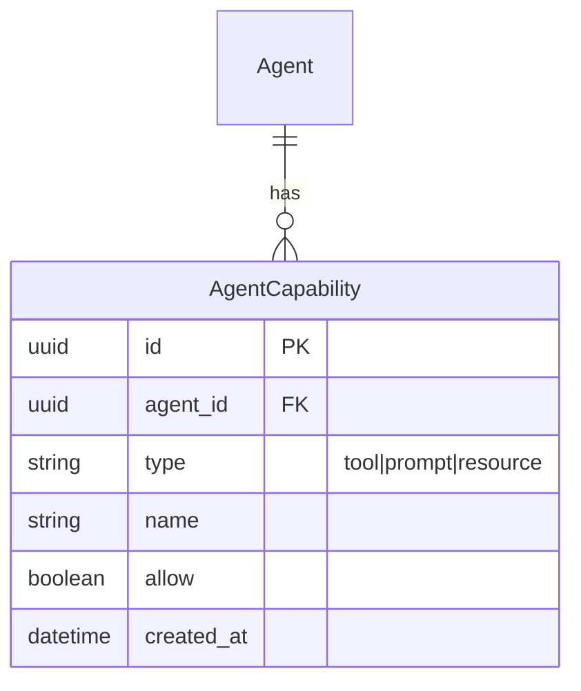
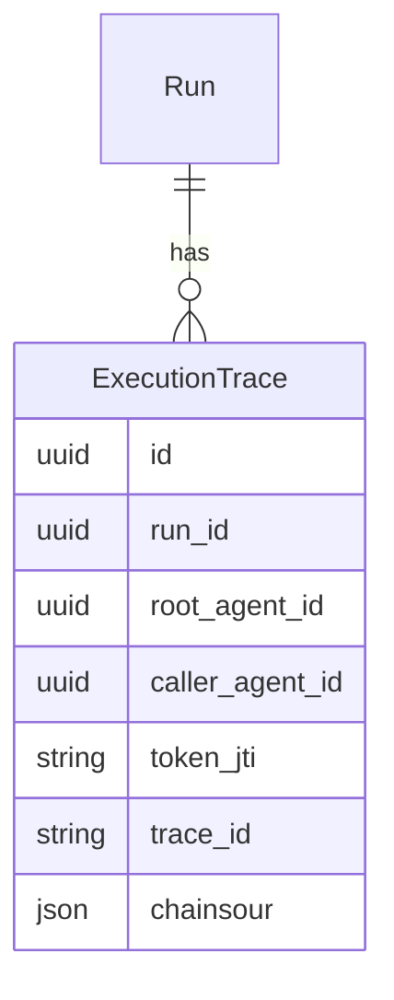
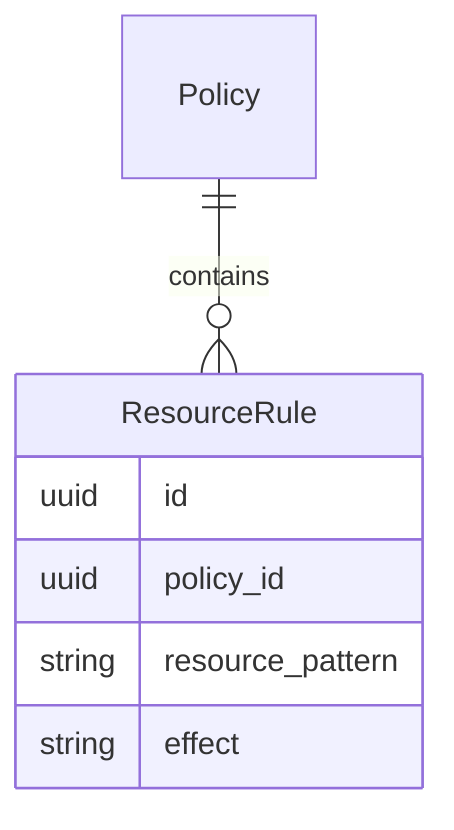

# A) Zero-Trust Execution Pipeline

(Replaces the old flowchart — much more precise for AgentxSuite)




**New Layers:**

- Capability Check
- Output Sanitization
- Execution Trace

## B) Multi-Agent Orchestration – Security Graph




**Important:**

- Worker-Agent cannot have stronger permissions than the Orchestrator.
- Root-Agent is carried through the entire pipeline.

## C) Shadow-Agent Prevention




**Fingerprint =**

- mTLS client cert hash
- device ID
- agent signature

## 2) Concrete Backend Change Proposals

I'm listing changes that you can implement in AgentxSuite immediately without breaking your MVP.

### ✅ A) Extend ServiceAccount with "capabilities"

**New field:**

```python
capabilities = JSONField(default=dict)
```


**Examples:**

```json
{
  "tools_allow": ["pdf.read", "storage.list"],
  "prompts_allow": ["*"],
  "resources_allow": ["projectA/*"],
  "max_input_bytes": 20000,
  "deny_http_urls": ["169.254.169.254"]
}
```

### ✅ B) Extend ExecutionContext

**New attribute:**

```python
ExecutionContext(
    root_agent_id,
    caller_agent_id,
    token_jti,
    capabilities,
    trace_id
)
```


This allows you to secure multi-agent workflows.

### ✅ C) Output-Sanitizer in Backend

In your `execute_tool_run` pipeline:

```python
def sanitize_output(output_json):
    if contains_secrets(output_json):
        raise SecurityError("Output contains forbidden patterns")
    return output_json
```

**Patterns:**

- JWTs
- AWS Keys
- DB Connection Strings
- Runtime IP
- URLs outside Allowed Domains

### ✅ D) PDP at Resource-, Prompt- and Metadata-Level

You currently have Policies before Tool-Execution.

Extend the following endpoints:

- `/mcp/**/resources/`
- `/mcp/**/prompts/`
- `/connections/**/sync/`

All get:

```python
pdp.evaluate("resource.read", resource_uri)
```

### ✅ E) Forbidden Input Patterns

In Service Layer:

```python
if input_json.matches(forbidden_patterns):
    deny
```

**Examples:**

- `<script>`
- base64 payloads over N KB
- URLs outside allowlist

### ✅ F) Token + mTLS Binding (Optional for Enterprise)

In ServiceAccount:

```python
allowed_client_cert_fingerprints
```

**Validate:**

```python
incoming_cert_hash in allowed_client_cert_fingerprints
```

## 3) ERD Improvements for More Granular Policies

Below is a clean extension of your ERD for Policies.

### A) New Table: AgentCapability




This allows, for example:

Agent may only use pdf.read

Agent may not use storage.write

Agent may only access resources under projectX/**

### B) More Granular PolicyRule

Currently:

action, target, effect


Extended with:

limit_per_minute
max_payload_size
time_restricted (08:00-20:00)
allow_params (regex)
deny_params (regex)


ERD Extension:

```mermaid
erDiagram
PolicyRule {
    uuid id
    uuid policy_id
    string action
    string target
    string effect
    json conditions         // remains
    json limits             // new
}
```

### C) New Table: ExecutionTrace




You need this for real orchestration.

### D) Store Resource Access Control Separately




This way you don't have to misuse Tool-Rules
