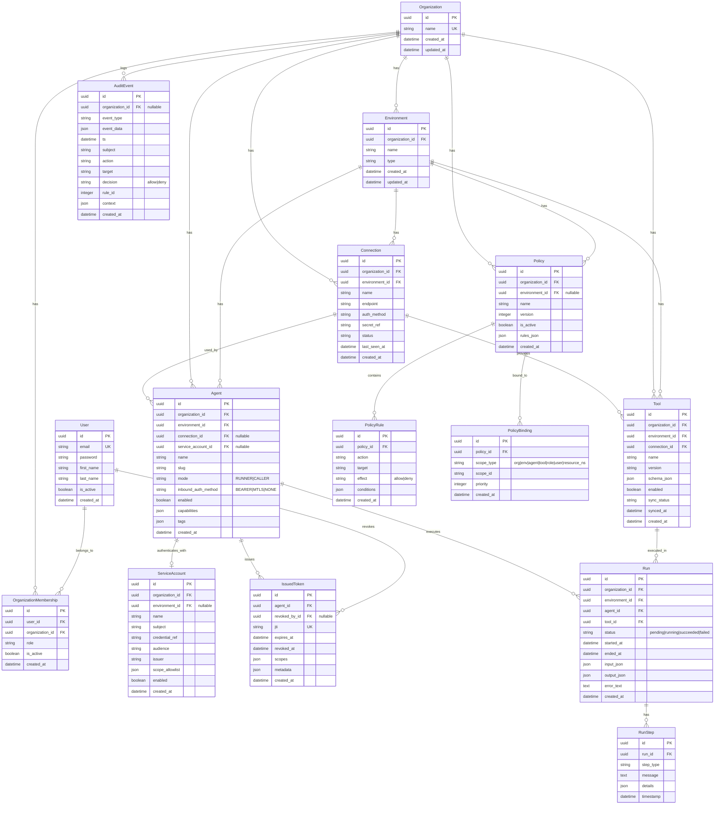
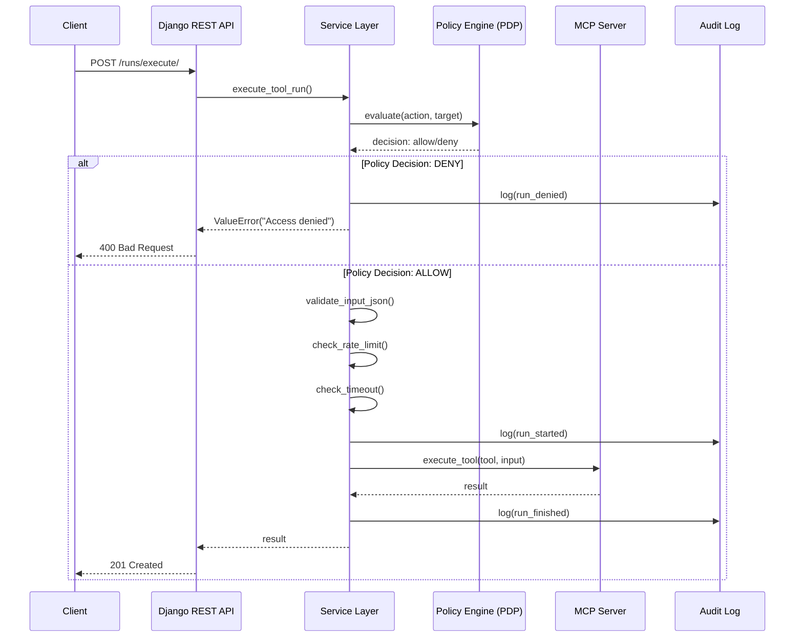
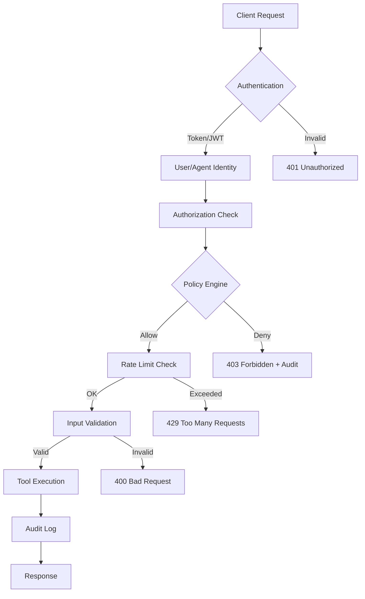

# 🏗️ AgentxSuite - Architecture Visualization

## 📊 Entity-Relationship Diagram (Models)



## 🔌 API Endpoints Overview

### 🔐 Authentication (`/api/v1/auth/`)

| Method | Endpoint | Description | Auth |
|--------|----------|-------------|------|
| `POST` | `/api/v1/auth/register/` | Register user | ❌ |
| `POST` | `/api/v1/auth/login/` | User login & get token | ❌ |
| `POST` | `/api/v1/auth/logout/` | User logout & delete token | ✅ |
| `GET` | `/api/v1/auth/me/` | Current user & organization | ✅ |
| `PUT/PATCH` | `/api/v1/auth/me/` | Update user profile | ✅ |
| `GET` | `/api/v1/auth/me/orgs/` | List user organizations | ✅ |
| `POST` | `/api/v1/auth/me/orgs/` | Add user to organization | ✅ |

### 🏢 Organizations & Environments (`/api/v1/orgs/`)

| Method | Endpoint | Description | Auth |
|--------|----------|-------------|------|
| `GET` | `/api/v1/orgs/` | List organizations | ✅ |
| `POST` | `/api/v1/orgs/` | Create organization | ✅ |
| `GET` | `/api/v1/orgs/{org_id}/` | Organization details | ✅ |
| `PUT/PATCH` | `/api/v1/orgs/{org_id}/` | Update organization | ✅ |
| `DELETE` | `/api/v1/orgs/{org_id}/` | Delete organization | ✅ |
| `GET` | `/api/v1/orgs/{org_id}/environments/` | List environments | ✅ |
| `POST` | `/api/v1/orgs/{org_id}/environments/` | Create environment | ✅ |
| `GET` | `/api/v1/orgs/{org_id}/environments/{env_id}/` | Environment details | ✅ |
| `PUT/PATCH` | `/api/v1/orgs/{org_id}/environments/{env_id}/` | Update environment | ✅ |
| `DELETE` | `/api/v1/orgs/{org_id}/environments/{env_id}/` | Delete environment | ✅ |

### 🔗 Connections (`/api/v1/orgs/{org_id}/connections/`)

| Method | Endpoint | Description | Auth |
|--------|----------|-------------|------|
| `GET` | `/api/v1/orgs/{org_id}/connections/` | List connections | ✅ |
| `POST` | `/api/v1/orgs/{org_id}/connections/` | Create connection | ✅ |
| `GET` | `/api/v1/orgs/{org_id}/connections/{id}/` | Connection details | ✅ |
| `PUT/PATCH` | `/api/v1/orgs/{org_id}/connections/{id}/` | Update connection | ✅ |
| `DELETE` | `/api/v1/orgs/{org_id}/connections/{id}/` | Delete connection | ✅ |
| `POST` | `/api/v1/connections/{id}/test/` | Test connection | ✅ |
| `POST` | `/api/v1/connections/{id}/sync/` | Sync tools from connection | ✅ |
| `POST` | `/api/v1/orgs/{org_id}/connections/store-secret/` | Store secret in SecretStore | ✅ |

### 🤖 Agents (`/api/v1/orgs/{org_id}/agents/`)

| Method | Endpoint | Description | Auth |
|--------|----------|-------------|------|
| `GET` | `/api/v1/orgs/{org_id}/agents/` | List agents | ✅ |
| `POST` | `/api/v1/orgs/{org_id}/agents/` | Create agent | ✅ |
| `GET` | `/api/v1/orgs/{org_id}/agents/{id}/` | Agent details | ✅ |
| `PUT/PATCH` | `/api/v1/orgs/{org_id}/agents/{id}/` | Update agent | ✅ |
| `DELETE` | `/api/v1/orgs/{org_id}/agents/{id}/` | Delete agent | ✅ |
| `POST` | `/api/v1/orgs/{org_id}/agents/{id}/ping/` | Test agent status & connection | ✅ |
| `GET` | `/api/v1/orgs/{org_id}/agents/{id}/tokens/` | List tokens | ✅ |
| `POST` | `/api/v1/orgs/{org_id}/agents/{id}/tokens/` | Generate token | ✅ |
| `POST` | `/api/v1/orgs/{org_id}/agents/{id}/tokens/{jti}/revoke/` | Revoke token | ✅ |
| `DELETE` | `/api/v1/orgs/{org_id}/agents/{id}/tokens/{jti}/` | Delete token (only if revoked/expired) | ✅ |
| `POST` | `/api/v1/orgs/{org_id}/agents/create-axcore/` | Create AxCore agent completely | ✅ |

### 🛠️ Tools (`/api/v1/orgs/{org_id}/tools/`)

| Method | Endpoint | Description | Auth |
|--------|----------|-------------|------|
| `GET` | `/api/v1/orgs/{org_id}/tools/` | List tools | ✅ |
| `POST` | `/api/v1/orgs/{org_id}/tools/` | Create tool | ✅ |
| `GET` | `/api/v1/orgs/{org_id}/tools/{id}/` | Tool details | ✅ |
| `PUT/PATCH` | `/api/v1/orgs/{org_id}/tools/{id}/` | Update tool | ✅ |
| `DELETE` | `/api/v1/orgs/{org_id}/tools/{id}/` | Delete tool | ✅ |

### ▶️ Runs (`/api/v1/orgs/{org_id}/runs/`)

| Method | Endpoint | Description | Auth |
|--------|----------|-------------|------|
| `GET` | `/api/v1/orgs/{org_id}/runs/` | List runs | ✅ |
| `GET` | `/api/v1/orgs/{org_id}/runs/{id}/` | Run details | ✅ |
| `GET` | `/api/v1/orgs/{org_id}/runs/{id}/steps/` | List run steps | ✅ |
| `POST` | `/api/v1/orgs/{org_id}/runs/execute/` | **Unified Tool Execution** (recommended) | ✅ |

### 🔒 Policies (`/api/v1/orgs/{org_id}/policies/`)

| Method | Endpoint | Description | Auth |
|--------|----------|-------------|------|
| `GET` | `/api/v1/orgs/{org_id}/policies/` | List policies | ✅ |
| `POST` | `/api/v1/orgs/{org_id}/policies/` | Create policy | ✅ |
| `GET` | `/api/v1/orgs/{org_id}/policies/{id}/` | Policy details | ✅ |
| `PUT/PATCH` | `/api/v1/orgs/{org_id}/policies/{id}/` | Update policy | ✅ |
| `DELETE` | `/api/v1/orgs/{org_id}/policies/{id}/` | Delete policy | ✅ |
| `POST` | `/api/v1/orgs/{org_id}/policies/{id}/rules/` | Add rule to policy | ✅ |
| `POST` | `/api/v1/orgs/{org_id}/policies/evaluate/` | Evaluate policy | ✅ |
| `POST` | `/api/v1/policies/evaluate/` | Evaluate policy (global) | ✅ |

#### Policy Rules (`/api/v1/policies/rules/`)

| Method | Endpoint | Description | Auth |
|--------|----------|-------------|------|
| `GET` | `/api/v1/policies/rules/` | List rules | ✅ |
| `POST` | `/api/v1/policies/rules/` | Create rule | ✅ |
| `GET` | `/api/v1/policies/rules/{id}/` | Rule details | ✅ |
| `PUT/PATCH` | `/api/v1/policies/rules/{id}/` | Update rule | ✅ |
| `DELETE` | `/api/v1/policies/rules/{id}/` | Delete rule | ✅ |

#### Policy Bindings (`/api/v1/policies/bindings/`)

| Method | Endpoint | Description | Auth |
|--------|----------|-------------|------|
| `GET` | `/api/v1/policies/bindings/` | List bindings | ✅ |
| `POST` | `/api/v1/policies/bindings/` | Create binding | ✅ |
| `GET` | `/api/v1/policies/bindings/{id}/` | Binding details | ✅ |
| `PUT/PATCH` | `/api/v1/policies/bindings/{id}/` | Update binding | ✅ |
| `DELETE` | `/api/v1/policies/bindings/{id}/` | Delete binding | ✅ |

### 🔍 Audit (`/api/v1/orgs/{org_id}/audit/`)

| Method | Endpoint | Description | Auth |
|--------|----------|-------------|------|
| `GET` | `/api/v1/orgs/{org_id}/audit/` | List audit events (with filters) | ✅ |
| `GET` | `/api/v1/orgs/{org_id}/audit/{id}/` | Audit event details | ✅ |
| `GET` | `/api/v1/audit/` | Global audit events (last 24h) | ✅ |

**Filter Parameters:**
- `subject` - Filter by subject (Agent/User/Client)
- `action` - Filter by action (e.g., `tool.invoke`)
- `target` - Filter by target (e.g., `tool:pdf/read`)
- `decision` - Filter by decision (`allow`/`deny`)
- `ts_from` - Time window start
- `ts_to` - Time window end

### 👤 Service Accounts (`/api/v1/orgs/{org_id}/service-accounts/`)

| Method | Endpoint | Description | Auth |
|--------|----------|-------------|------|
| `GET` | `/api/v1/orgs/{org_id}/service-accounts/` | List service accounts | ✅ |
| `POST` | `/api/v1/orgs/{org_id}/service-accounts/` | Create service account | ✅ |
| `GET` | `/api/v1/orgs/{org_id}/service-accounts/{id}/` | Service account details | ✅ |
| `PUT/PATCH` | `/api/v1/orgs/{org_id}/service-accounts/{id}/` | Update service account | ✅ |
| `DELETE` | `/api/v1/orgs/{org_id}/service-accounts/{id}/` | Delete service account | ✅ |

### 🌐 MCP Extensions (`/api/v1/orgs/{org_id}/mcp/`)

| Method | Endpoint | Description | Auth |
|--------|----------|-------------|------|
| `GET` | `/api/v1/orgs/{org_id}/mcp/{env_id}/resources/` | List MCP resources | ✅ |
| `GET` | `/api/v1/orgs/{org_id}/mcp/{env_id}/resources/{uri}/` | MCP resource details | ✅ |
| `GET` | `/api/v1/orgs/{org_id}/mcp/{env_id}/prompts/` | List MCP prompts | ✅ |
| `GET` | `/api/v1/orgs/{org_id}/mcp/{env_id}/prompts/{name}/` | MCP prompt details | ✅ |

## 🔄 Data Flow Diagram



## 🏛️ Architecture Layers

```
┌─────────────────────────────────────────────────────────┐
│                    Client Layer                          │
│  (Frontend, CLI, MCP Clients, External Services)        │
└────────────────────┬────────────────────────────────────┘
                     │
                     ▼
┌─────────────────────────────────────────────────────────┐
│                    API Layer (DRF)                       │
│  - ViewSets (CRUD)                                       │
│  - Serializers (Validation)                             │
│  - Authentication (Token/JWT)                           │
│  - Audit Logging Mixin                                  │
└────────────────────┬────────────────────────────────────┘
                     │
                     ▼
┌─────────────────────────────────────────────────────────┐
│                  Service Layer                           │
│  - Business Logic                                        │
│  - Policy Checks (PDP)                                   │
│  - Rate Limiting                                         │
│  - Timeout Management                                    │
│  - MCP Integration                                       │
│  - Secret Management                                     │
└────────────────────┬────────────────────────────────────┘
                     │
         ┌───────────┴───────────┐
         ▼                        ▼
┌──────────────────┐    ┌──────────────────┐
│   Model Layer    │    │  External APIs    │
│  - Django ORM    │    │  - MCP Servers    │
│  - Validations   │    │  - SecretStore    │
│  - Relationships │    │  - Redis (Rate)   │
└──────────────────┘    └──────────────────┘
```

## 🔐 Security Flow



## 📝 Important Constraints & Validations

### Model Constraints

1. **Organization**
   - `name` is unique

2. **Environment**
   - `(organization, name)` is unique

3. **Connection**
   - `(organization, environment, name)` is unique

4. **Tool**
   - `(organization, environment, name, version)` is unique

5. **Agent**
   - `(organization, environment, name)` is unique
   - `(organization, environment, slug)` is unique (case-insensitive)
   - `RUNNER` mode requires `connection`
   - `BEARER` auth requires `bearer_secret_ref` or `inbound_secret_ref`
   - `MTLS` auth requires `mtls_cert_ref` and `mtls_key_ref`

6. **Policy**
   - `(organization, name)` is unique

7. **ServiceAccount**
   - `(organization, name)` is unique
   - `(subject, issuer)` is unique

8. **IssuedToken**
   - `jti` is unique

### API Validations

- **Cross-Field Validation**: `environment.organization == organization` (in Serializers)
- **Policy Evaluation**: Before every tool run
- **JSON Schema Validation**: Tool inputs are validated against `schema_json`
- **Rate Limiting**: Per `agent_id + tool_id` (Redis Token Bucket)
- **Timeout**: Configurable per run (default: 30s)

## 🎯 Multi-Tenancy

All resources are **organization-scoped**:
- URLs: `/api/v1/orgs/{org_id}/...`
- Models: `organization` + `environment` ForeignKeys
- Filtering: Automatically by `org_id` from URL

**Exceptions:**
- `/api/v1/auth/` - User-specific
- `/api/v1/policies/evaluate/` - Can be called without `org_id`
- `/api/v1/audit/` - Globally available (last 24h)

---

**Created:** 2025-01-27  
**Version:** 1.0  
**Status:** Current for AgentxSuite MVP
