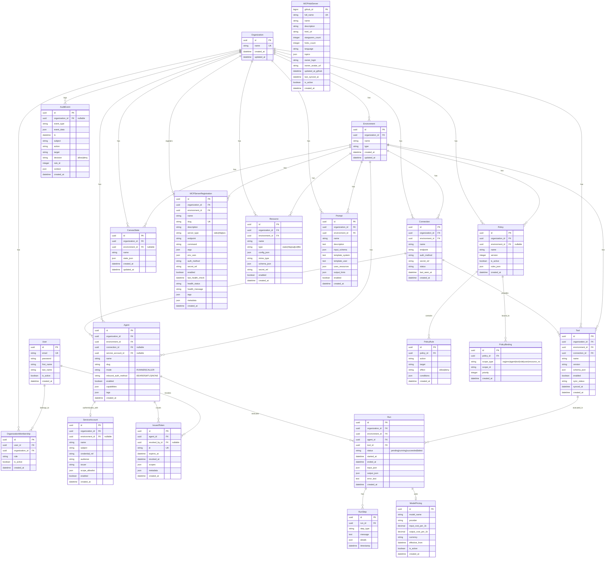
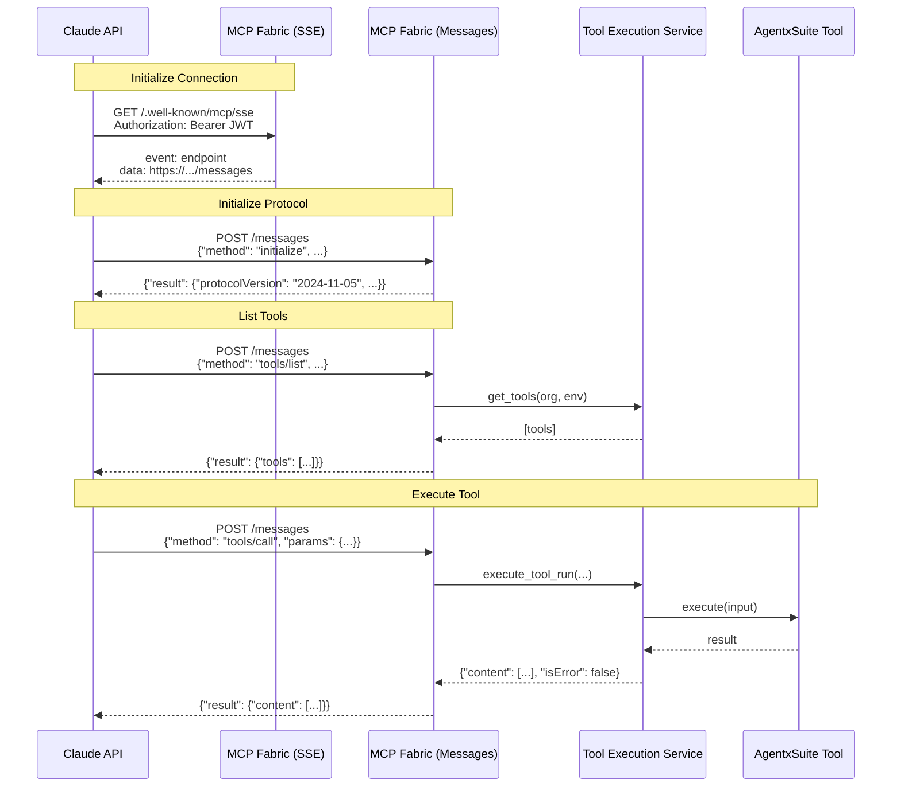
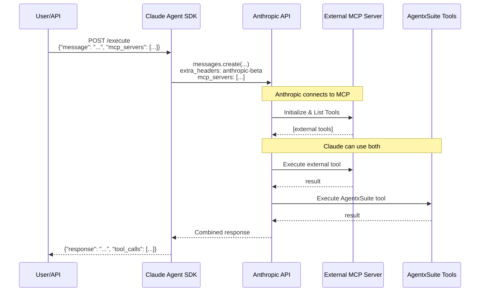
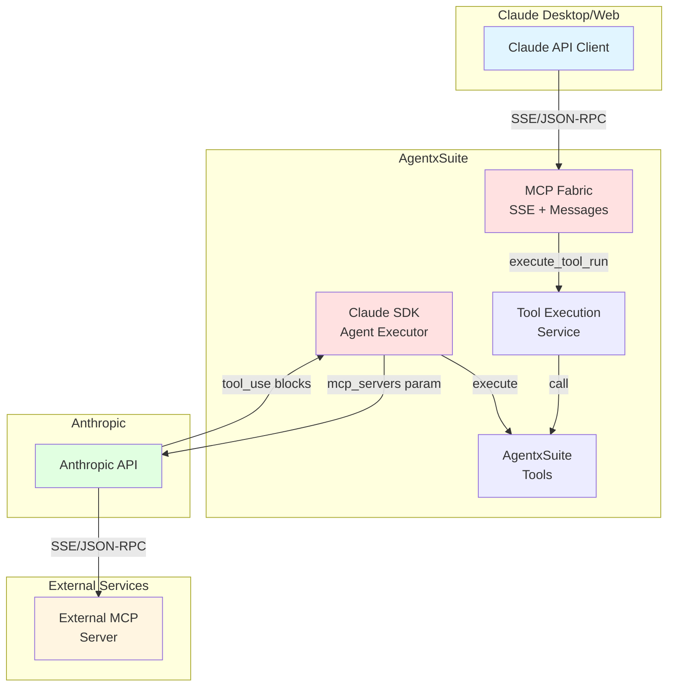
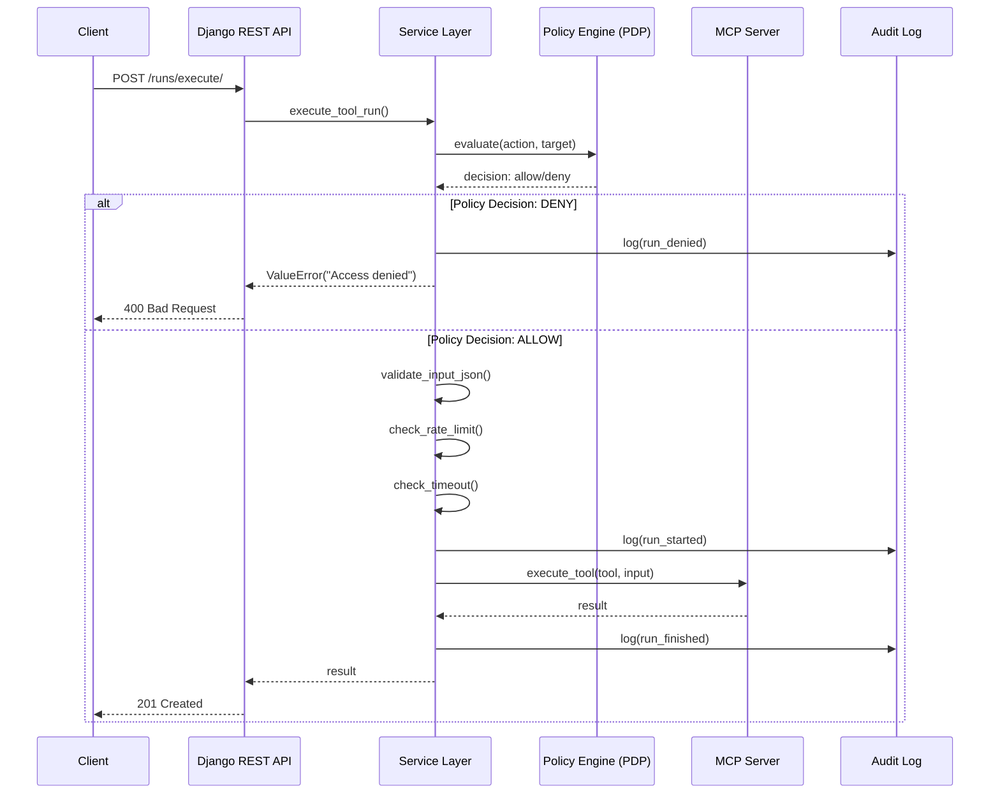
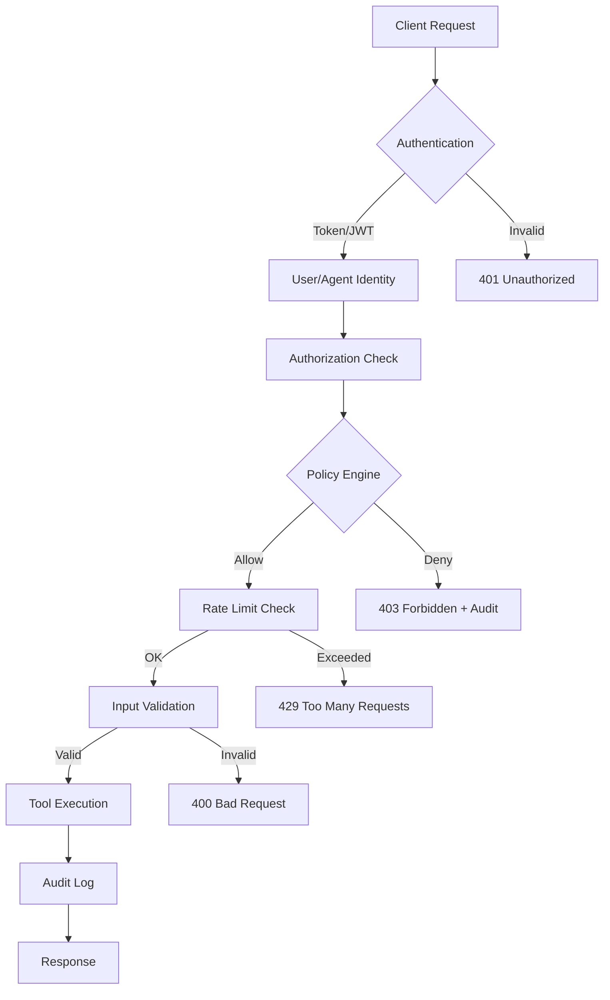

# 🏗️ AgentxSuite - Architecture Visualization

## 🎯 Key Features

AgentxSuite is a **Zero-Trust Agent Execution Platform** with the following core capabilities:

### 🔐 Security & Governance
- **Zero-Trust Policy Engine (PDP)**: Every tool execution is checked against policies before execution
- **Secret Management**: Fernet-encrypted secrets with KMS support, never exposed in API responses
- **Rate Limiting**: Redis-based token bucket per agent+tool
- **Timeout Guards**: Configurable execution timeouts with context managers
- **Audit Logging**: Comprehensive audit trail for all actions (create/update/delete/execute)

### 🤖 Agent & Tool Management
- **Multi-Mode Agents**: Support for RUNNER (executes tools) and CALLER (invokes other agents) modes
- **Multiple Authentication**: BEARER tokens, mTLS certificates, or no auth (NONE)
- **Token Management**: Generate, revoke, and expire JWT tokens per agent
- **MCP Integration**: Native support for Model Context Protocol (stdio & HTTP)
- **Tool Sync**: Automatic tool discovery and schema sync from MCP servers

### 🌐 MCP Extensions
- **MCP Hub**: Discover and browse MCP servers from GitHub (1000+ servers)
- **MCP Server Registry**: Register and manage external MCP servers (stdio/HTTP/WebSocket)
- **Resources & Prompts**: Store and manage MCP resources and prompt templates
- **HTTP Bridge**: Bridge between Claude Desktop and AgentxSuite cloud

### 🤖 Claude Integration
- **Claude Agent SDK**: Native integration for Claude Hosted Agents
- **OAuth 2.0 Flow**: Secure authorization code flow with PKCE
- **Agent Manifest**: Auto-generated manifest for Claude discovery
- **OpenAPI Spec**: Dynamic OpenAPI specification for tool schemas
- **MCP Connector Support**: 
  - **Server Mode**: Expose AgentxSuite tools to Claude via SSE/HTTP (JSON-RPC)
  - **Client Mode**: AgentxSuite agents can connect to external MCP servers
  - **Bi-directional**: Claude can use AgentxSuite tools AND AgentxSuite can use external tools simultaneously

### 💰 Cost Analytics
- **Token Usage Tracking**: Track input/output tokens for every LLM call
- **Cost Calculation**: Automatic cost calculation based on model pricing
- **Multi-Model Support**: OpenAI, Anthropic, Groq, and custom models
- **Cost Dashboards**: Cost breakdown by agent, model, environment, and time

### 🎨 Visual Tools
- **Agent Designer**: Visual canvas for designing agent workflows (React Flow)
- **Connection Graph**: Visualize relationships between agents, tools, and connections
- **Run Timeline**: Visual timeline of tool executions with status and errors

### 🏢 Multi-Tenancy
- **Organization-Scoped**: All resources belong to an organization
- **Environment Isolation**: Separate dev/staging/prod environments
- **RBAC**: Role-based access control (owner/admin/member/viewer)
- **Cross-Org Security**: Strict validation that environment belongs to organization

### 📊 Observability
- **OpenTelemetry**: Distributed tracing for all requests
- **Metrics**: Prometheus-compatible metrics for monitoring
- **Structured Logging**: JSON logs with trace/run IDs
- **Health Checks**: Health endpoints for all services

## 📊 Entity-Relationship Diagram (Models)



## 📦 Django Apps Overview

AgentxSuite is organized into the following Django apps:

| App | Purpose | Key Models |
|-----|---------|------------|
| **accounts** | User management, authentication, service accounts | `User`, `OrganizationMembership`, `ServiceAccount` |
| **tenants** | Multi-tenancy (organizations & environments) | `Organization`, `Environment` |
| **connections** | MCP server connections & tool sync | `Connection` |
| **tools** | Tool registry & schema management | `Tool` |
| **agents** | Agent management & token issuance | `Agent`, `IssuedToken` |
| **runs** | Tool execution & cost tracking | `Run`, `RunStep`, `ModelPricing` |
| **policies** | Policy engine (Zero-Trust PDP) | `Policy`, `PolicyRule`, `PolicyBinding` |
| **audit** | Audit logging for all actions | `AuditEvent` |
| **mcp_ext** | MCP extensions (resources, prompts, hub) | `Resource`, `Prompt`, `MCPServerRegistration`, `MCPHubServer` |
| **canvas** | Visual canvas state management | `CanvasState` |
| **claude_agent** | Claude Agent SDK integration (OAuth + execution) | _(no models, uses existing)_ |
| **system_tools** | Built-in system tools & usage tracking | _(no models, service layer)_ |
| **secretstore** | Secret encryption & storage | `Secret` |
| **workflows** | _(Future: Workflow orchestration)_ | _(TBD)_ |

### Libraries (`libs/`)

| Library | Purpose |
|---------|---------|
| **libs/common** | Base models (`TimeStamped`, `UUIDModel`), shared utilities |
| **libs/secretstore** | Secret encryption (Fernet), KMS integration |
| **libs/security** | Guards, Rate Limiting, Timeout, Audit Hooks |

## 🔌 API Endpoints Overview

### 🔐 Authentication (`/api/v1/auth/`)

| Method | Endpoint | Description | Auth |
|--------|----------|-------------|------|
| `POST` | `/api/v1/auth/register/` | Register user | ❌ |
| `POST` | `/api/v1/auth/login/` | User login & get token | ❌ |
| `POST` | `/api/v1/auth/logout/` | User logout & delete token | ✅ |
| `GET` | `/api/v1/auth/me/` | Current user & organization | ✅ |
| `PUT/PATCH` | `/api/v1/auth/me/` | Update user profile | ✅ |
| `GET` | `/api/v1/auth/me/orgs/` | List user organizations | ✅ |
| `POST` | `/api/v1/auth/me/orgs/` | Add user to organization | ✅ |

### 🏢 Organizations & Environments (`/api/v1/orgs/`)

| Method | Endpoint | Description | Auth |
|--------|----------|-------------|------|
| `GET` | `/api/v1/orgs/` | List organizations | ✅ |
| `POST` | `/api/v1/orgs/` | Create organization | ✅ |
| `GET` | `/api/v1/orgs/{org_id}/` | Organization details | ✅ |
| `PUT/PATCH` | `/api/v1/orgs/{org_id}/` | Update organization | ✅ |
| `DELETE` | `/api/v1/orgs/{org_id}/` | Delete organization | ✅ |
| `GET` | `/api/v1/orgs/{org_id}/environments/` | List environments | ✅ |
| `POST` | `/api/v1/orgs/{org_id}/environments/` | Create environment | ✅ |
| `GET` | `/api/v1/orgs/{org_id}/environments/{env_id}/` | Environment details | ✅ |
| `PUT/PATCH` | `/api/v1/orgs/{org_id}/environments/{env_id}/` | Update environment | ✅ |
| `DELETE` | `/api/v1/orgs/{org_id}/environments/{env_id}/` | Delete environment | ✅ |

### 🔗 Connections (`/api/v1/orgs/{org_id}/connections/`)

| Method | Endpoint | Description | Auth |
|--------|----------|-------------|------|
| `GET` | `/api/v1/orgs/{org_id}/connections/` | List connections | ✅ |
| `POST` | `/api/v1/orgs/{org_id}/connections/` | Create connection | ✅ |
| `GET` | `/api/v1/orgs/{org_id}/connections/{id}/` | Connection details | ✅ |
| `PUT/PATCH` | `/api/v1/orgs/{org_id}/connections/{id}/` | Update connection | ✅ |
| `DELETE` | `/api/v1/orgs/{org_id}/connections/{id}/` | Delete connection | ✅ |
| `POST` | `/api/v1/connections/{id}/test/` | Test connection | ✅ |
| `POST` | `/api/v1/connections/{id}/sync/` | Sync tools from connection | ✅ |
| `POST` | `/api/v1/orgs/{org_id}/connections/store-secret/` | Store secret in SecretStore | ✅ |

### 🤖 Agents (`/api/v1/orgs/{org_id}/agents/`)

| Method | Endpoint | Description | Auth |
|--------|----------|-------------|------|
| `GET` | `/api/v1/orgs/{org_id}/agents/` | List agents | ✅ |
| `POST` | `/api/v1/orgs/{org_id}/agents/` | Create agent | ✅ |
| `GET` | `/api/v1/orgs/{org_id}/agents/{id}/` | Agent details | ✅ |
| `PUT/PATCH` | `/api/v1/orgs/{org_id}/agents/{id}/` | Update agent | ✅ |
| `DELETE` | `/api/v1/orgs/{org_id}/agents/{id}/` | Delete agent | ✅ |
| `POST` | `/api/v1/orgs/{org_id}/agents/{id}/ping/` | Test agent status & connection | ✅ |
| `GET` | `/api/v1/orgs/{org_id}/agents/{id}/tokens/` | List tokens | ✅ |
| `POST` | `/api/v1/orgs/{org_id}/agents/{id}/tokens/` | Generate token | ✅ |
| `POST` | `/api/v1/orgs/{org_id}/agents/{id}/tokens/{jti}/revoke/` | Revoke token | ✅ |
| `DELETE` | `/api/v1/orgs/{org_id}/agents/{id}/tokens/{jti}/` | Delete token (only if revoked/expired) | ✅ |
| `POST` | `/api/v1/orgs/{org_id}/agents/create-axcore/` | Create AxCore agent completely | ✅ |

### 🛠️ Tools (`/api/v1/orgs/{org_id}/tools/`)

| Method | Endpoint | Description | Auth |
|--------|----------|-------------|------|
| `GET` | `/api/v1/orgs/{org_id}/tools/` | List tools | ✅ |
| `POST` | `/api/v1/orgs/{org_id}/tools/` | Create tool | ✅ |
| `GET` | `/api/v1/orgs/{org_id}/tools/{id}/` | Tool details | ✅ |
| `PUT/PATCH` | `/api/v1/orgs/{org_id}/tools/{id}/` | Update tool | ✅ |
| `DELETE` | `/api/v1/orgs/{org_id}/tools/{id}/` | Delete tool | ✅ |

### ▶️ Runs (`/api/v1/orgs/{org_id}/runs/`)

| Method | Endpoint | Description | Auth |
|--------|----------|-------------|------|
| `GET` | `/api/v1/orgs/{org_id}/runs/` | List runs | ✅ |
| `GET` | `/api/v1/orgs/{org_id}/runs/{id}/` | Run details | ✅ |
| `GET` | `/api/v1/orgs/{org_id}/runs/{id}/steps/` | List run steps | ✅ |
| `POST` | `/api/v1/orgs/{org_id}/runs/execute/` | **Unified Tool Execution** (recommended) | ✅ |

### 🔒 Policies (`/api/v1/orgs/{org_id}/policies/`)

| Method | Endpoint | Description | Auth |
|--------|----------|-------------|------|
| `GET` | `/api/v1/orgs/{org_id}/policies/` | List policies | ✅ |
| `POST` | `/api/v1/orgs/{org_id}/policies/` | Create policy | ✅ |
| `GET` | `/api/v1/orgs/{org_id}/policies/{id}/` | Policy details | ✅ |
| `PUT/PATCH` | `/api/v1/orgs/{org_id}/policies/{id}/` | Update policy | ✅ |
| `DELETE` | `/api/v1/orgs/{org_id}/policies/{id}/` | Delete policy | ✅ |
| `POST` | `/api/v1/orgs/{org_id}/policies/{id}/rules/` | Add rule to policy | ✅ |
| `POST` | `/api/v1/orgs/{org_id}/policies/evaluate/` | Evaluate policy | ✅ |
| `POST` | `/api/v1/policies/evaluate/` | Evaluate policy (global) | ✅ |

#### Policy Rules (`/api/v1/policies/rules/`)

| Method | Endpoint | Description | Auth |
|--------|----------|-------------|------|
| `GET` | `/api/v1/policies/rules/` | List rules | ✅ |
| `POST` | `/api/v1/policies/rules/` | Create rule | ✅ |
| `GET` | `/api/v1/policies/rules/{id}/` | Rule details | ✅ |
| `PUT/PATCH` | `/api/v1/policies/rules/{id}/` | Update rule | ✅ |
| `DELETE` | `/api/v1/policies/rules/{id}/` | Delete rule | ✅ |

#### Policy Bindings (`/api/v1/policies/bindings/`)

| Method | Endpoint | Description | Auth |
|--------|----------|-------------|------|
| `GET` | `/api/v1/policies/bindings/` | List bindings | ✅ |
| `POST` | `/api/v1/policies/bindings/` | Create binding | ✅ |
| `GET` | `/api/v1/policies/bindings/{id}/` | Binding details | ✅ |
| `PUT/PATCH` | `/api/v1/policies/bindings/{id}/` | Update binding | ✅ |
| `DELETE` | `/api/v1/policies/bindings/{id}/` | Delete binding | ✅ |

### 🔍 Audit (`/api/v1/orgs/{org_id}/audit/`)

| Method | Endpoint | Description | Auth |
|--------|----------|-------------|------|
| `GET` | `/api/v1/orgs/{org_id}/audit/` | List audit events (with filters) | ✅ |
| `GET` | `/api/v1/orgs/{org_id}/audit/{id}/` | Audit event details | ✅ |
| `GET` | `/api/v1/audit/` | Global audit events (last 24h) | ✅ |

**Filter Parameters:**
- `subject` - Filter by subject (Agent/User/Client)
- `action` - Filter by action (e.g., `tool.invoke`)
- `target` - Filter by target (e.g., `tool:pdf/read`)
- `decision` - Filter by decision (`allow`/`deny`)
- `ts_from` - Time window start
- `ts_to` - Time window end

### 👤 Service Accounts (`/api/v1/orgs/{org_id}/service-accounts/`)

| Method | Endpoint | Description | Auth |
|--------|----------|-------------|------|
| `GET` | `/api/v1/orgs/{org_id}/service-accounts/` | List service accounts | ✅ |
| `POST` | `/api/v1/orgs/{org_id}/service-accounts/` | Create service account | ✅ |
| `GET` | `/api/v1/orgs/{org_id}/service-accounts/{id}/` | Service account details | ✅ |
| `PUT/PATCH` | `/api/v1/orgs/{org_id}/service-accounts/{id}/` | Update service account | ✅ |
| `DELETE` | `/api/v1/orgs/{org_id}/service-accounts/{id}/` | Delete service account | ✅ |

### 🌐 MCP Extensions (`/api/v1/orgs/{org_id}/mcp/`)

| Method | Endpoint | Description | Auth |
|--------|----------|-------------|------|
| `GET` | `/api/v1/orgs/{org_id}/mcp/{env_id}/resources/` | List MCP resources | ✅ |
| `POST` | `/api/v1/orgs/{org_id}/mcp/{env_id}/resources/` | Create MCP resource | ✅ |
| `GET` | `/api/v1/orgs/{org_id}/mcp/{env_id}/resources/{id}/` | MCP resource details | ✅ |
| `PUT/PATCH` | `/api/v1/orgs/{org_id}/mcp/{env_id}/resources/{id}/` | Update MCP resource | ✅ |
| `DELETE` | `/api/v1/orgs/{org_id}/mcp/{env_id}/resources/{id}/` | Delete MCP resource | ✅ |
| `GET` | `/api/v1/orgs/{org_id}/mcp/{env_id}/prompts/` | List MCP prompts | ✅ |
| `POST` | `/api/v1/orgs/{org_id}/mcp/{env_id}/prompts/` | Create MCP prompt | ✅ |
| `GET` | `/api/v1/orgs/{org_id}/mcp/{env_id}/prompts/{id}/` | MCP prompt details | ✅ |
| `PUT/PATCH` | `/api/v1/orgs/{org_id}/mcp/{env_id}/prompts/{id}/` | Update MCP prompt | ✅ |
| `DELETE` | `/api/v1/orgs/{org_id}/mcp/{env_id}/prompts/{id}/` | Delete MCP prompt | ✅ |
| `GET` | `/api/v1/orgs/{org_id}/mcp/servers/` | List MCP server registrations | ✅ |
| `POST` | `/api/v1/orgs/{org_id}/mcp/servers/` | Register external MCP server | ✅ |
| `GET` | `/api/v1/orgs/{org_id}/mcp/servers/{id}/` | MCP server details | ✅ |
| `PUT/PATCH` | `/api/v1/orgs/{org_id}/mcp/servers/{id}/` | Update MCP server | ✅ |
| `DELETE` | `/api/v1/orgs/{org_id}/mcp/servers/{id}/` | Delete MCP server | ✅ |
| `POST` | `/api/v1/orgs/{org_id}/mcp/servers/{id}/health-check/` | Check MCP server health | ✅ |

### 🌐 MCP Hub (`/api/v1/mcp-hub/`)

| Method | Endpoint | Description | Auth |
|--------|----------|-------------|------|
| `GET` | `/api/v1/mcp-hub/hub-servers/` | List MCP servers from GitHub (with filters) | ✅ |
| `GET` | `/api/v1/mcp-hub/hub-servers/{id}/` | MCP Hub server details | ✅ |

**Filter Parameters:**
- `language` - Filter by programming language
- `min_stars` / `max_stars` - Filter by star count range
- `topics` - Filter by GitHub topics (comma-separated)
- `search` - Full-text search in name/description
- `ordering` - Sort by: `stargazers_count`, `-stargazers_count`, `updated_at_github`, `-updated_at_github`

**Management Command:**
```bash
python manage.py sync_mcp_hub --github-token YOUR_TOKEN
```

### 🎨 Canvas (`/api/v1/orgs/{org_id}/canvas/`)

| Method | Endpoint | Description | Auth |
|--------|----------|-------------|------|
| `GET` | `/api/v1/orgs/{org_id}/canvas/` | List canvas states | ✅ |
| `POST` | `/api/v1/orgs/{org_id}/canvas/` | Create canvas state | ✅ |
| `GET` | `/api/v1/orgs/{org_id}/canvas/{id}/` | Canvas state details | ✅ |
| `PUT/PATCH` | `/api/v1/orgs/{org_id}/canvas/{id}/` | Update canvas state | ✅ |
| `DELETE` | `/api/v1/orgs/{org_id}/canvas/{id}/` | Delete canvas state | ✅ |

### 🤖 Claude Agent SDK (`/api/v1/claude-agent/`)

| Method | Endpoint | Description | Auth |
|--------|----------|-------------|------|
| `GET` | `/api/v1/claude-agent/manifest` | Agent manifest for Claude | ❌ |
| `GET` | `/api/v1/claude-agent/.well-known/agent-manifest` | Agent discovery endpoint | ❌ |
| `GET` | `/api/v1/claude-agent/openapi.json` | OpenAPI specification | ❌ |
| `GET` | `/api/v1/claude-agent/authorize` | OAuth authorization endpoint | ❌ |
| `POST` | `/api/v1/claude-agent/token` | OAuth token exchange | ❌ |
| `POST` | `/api/v1/claude-agent/revoke` | OAuth token revocation | ✅ |
| `GET` | `/api/v1/claude-agent/tools` | List available tools | ✅ |
| `POST` | `/api/v1/claude-agent/execute` | Execute tool via Claude Agent | ✅ |
| `GET` | `/api/v1/claude-agent/health` | Health check | ❌ |

**Execute Request (with MCP Connector):**
```json
{
  "message": "Use external weather tool",
  "organization_id": "uuid",
  "environment_id": "uuid",
  "mcp_servers": [
    {
      "type": "url",
      "url": "https://weather-server.example.com/sse",
      "name": "weather-mcp",
      "authorization_token": "token"
    }
  ]
}
```

### 🔌 MCP Connector (MCP Fabric Service)

**Server Mode - AgentxSuite as MCP Server** (`/.well-known/mcp/`)

| Method | Endpoint | Description | Auth |
|--------|----------|-------------|------|
| `GET` | `/.well-known/mcp/sse` | SSE connection for MCP protocol | JWT |
| `POST` | `/.well-known/mcp/messages` | JSON-RPC 2.0 message handler | JWT |
| `GET` | `/.well-known/mcp/manifest.json` | MCP manifest | JWT |
| `GET` | `/.well-known/mcp/tools` | List available tools | JWT |
| `POST` | `/.well-known/mcp/run` | Execute tool | JWT |

**Scoped Endpoints** (`/mcp/{org_id}/{env_id}/.well-known/mcp/`)

Same endpoints as above, with explicit org/env in URL path.

**JSON-RPC Methods Supported:**
- `initialize` - Initialize MCP session
- `notifications/initialized` - Initialization complete (no response)
- `tools/list` - List available tools
- `tools/call` - Execute a tool

**SSE Protocol:**
```
GET /.well-known/mcp/sse
Authorization: Bearer <jwt-token>

< event: endpoint
< data: https://agentxsuite.com/.well-known/mcp/messages
```

**JSON-RPC Example (tools/call):**
```json
{
  "jsonrpc": "2.0",
  "method": "tools/call",
  "params": {
    "name": "execute_tool",
    "arguments": {
      "tool_identifier": "pdf/read",
      "input_data": {"file_path": "/path/to/doc.pdf"}
    }
  },
  "id": 1
}
```

## 🔄 MCP Connector Data Flow

### Server Mode: Claude → AgentxSuite



### Client Mode: AgentxSuite → External MCP Server



### Bi-directional Flow




### 💰 Cost Analytics & Pricing (`/api/v1/orgs/{org_id}/runs/`)

| Method | Endpoint | Description | Auth |
|--------|----------|-------------|------|
| `GET` | `/api/v1/orgs/{org_id}/runs/cost-summary/` | Get cost summary with filters | ✅ |
| `GET` | `/api/v1/orgs/{org_id}/runs/cost-by-agent/` | Cost breakdown by agent | ✅ |
| `GET` | `/api/v1/orgs/{org_id}/runs/cost-by-model/` | Cost breakdown by model | ✅ |
| `GET` | `/api/v1/orgs/{org_id}/runs/cost-over-time/` | Cost trends over time | ✅ |
| `GET` | `/api/v1/pricing/models/` | List model pricing | ✅ |
| `GET` | `/api/v1/pricing/models/{id}/` | Model pricing details | ✅ |
| `POST` | `/api/v1/pricing/models/` | Create/update model pricing (admin) | ✅ |

**Cost Analytics Filter Parameters:**
- `start_date` / `end_date` - Date range filter
- `agent_id` - Filter by specific agent
- `environment_id` - Filter by environment
- `model_name` - Filter by LLM model
- `grouping` - Time grouping: `hour`, `day`, `week`, `month`

## 🔄 Data Flow Diagram



## 🏛️ Architecture Layers

```
┌───────────────────────────────────────────────────────────────────┐
│                         Client Layer                              │
│  - Web Frontend (Next.js + React)                                │
│  - Claude Desktop (via stdio/HTTP Bridge)                        │
│  - Claude Hosted Agent (via Agent SDK)                           │
│  - External Services (API Clients)                               │
│  - CLI Tools                                                      │
└────────────────────────────┬──────────────────────────────────────┘
                             │
                             ▼
┌───────────────────────────────────────────────────────────────────┐
│                       API Layer (DRF)                             │
│  - ViewSets (CRUD Operations)                                     │
│  - Serializers (Validation & Transformation)                      │
│  - Authentication (Token/JWT/OAuth2)                              │
│  - Audit Logging Mixin (Auto-Logging)                            │
│  - Permission Classes (RBAC)                                      │
│  - Pagination & Filtering                                         │
└────────────────────────────┬──────────────────────────────────────┘
                             │
                             ▼
┌───────────────────────────────────────────────────────────────────┐
│                       Service Layer                               │
│  - Business Logic (services.py)                                   │
│  - Policy Engine (PDP) - Zero-Trust Checks                       │
│  - Rate Limiting (Redis Token Bucket)                            │
│  - Timeout Management (Context Managers)                         │
│  - MCP Integration (stdio/HTTP adapters)                         │
│  - Secret Management (Fernet/KMS)                                │
│  - Cost Tracking (Token Usage Analytics)                         │
│  - Tool Execution Pipeline                                        │
│  - Agent Registry (Claude SDK)                                    │
└────────────────────────────┬──────────────────────────────────────┘
                             │
           ┌─────────────────┴─────────────────┐
           ▼                                    ▼
┌────────────────────────┐         ┌───────────────────────────┐
│     Model Layer        │         │    External Services      │
│  - Django ORM          │         │  - MCP Servers (stdio)    │
│  - Model Validations   │         │  - MCP Servers (HTTP)     │
│  - Constraints         │         │  - SecretStore (Fernet)   │
│  - Relationships       │         │  - Redis (Cache/Rate)     │
│  - Soft Delete         │         │  - GitHub API (MCP Hub)   │
│  - TimeStamped Mixin   │         │  - Claude API (Agent SDK) │
└────────────────────────┘         └───────────────────────────┘
```

## 🔐 Security Flow



## 📝 Important Constraints & Validations

### Model Constraints

1. **Organization**
   - `name` is unique

2. **Environment**
   - `(organization, name)` is unique

3. **Connection**
   - `(organization, environment, name)` is unique

4. **Tool**
   - `(organization, environment, name, version)` is unique

5. **Agent**
   - `(organization, environment, name)` is unique
   - `(organization, environment, slug)` is unique (case-insensitive)
   - `RUNNER` mode requires `connection`
   - `BEARER` auth requires `bearer_secret_ref` or `inbound_secret_ref`
   - `MTLS` auth requires `mtls_cert_ref` and `mtls_key_ref`

6. **Policy**
   - `(organization, name)` is unique

7. **ServiceAccount**
   - `(organization, name)` is unique
   - `(subject, issuer)` is unique

8. **IssuedToken**
   - `jti` is unique

9. **CanvasState**
   - `(organization, environment, name)` is unique

10. **MCPServerRegistration**
    - `(organization, environment, slug)` is unique
    - `stdio` servers require `command`
    - `http`/`ws` servers require `endpoint`
    - Environment must belong to organization

11. **MCPHubServer**
    - `github_id` is unique
    - `full_name` is unique

12. **Resource**
    - `(organization, environment, name)` is unique

13. **Prompt**
    - `(organization, environment, name)` is unique

14. **ModelPricing**
    - `(model_name, effective_from)` is unique

### API Validations

- **Cross-Field Validation**: `environment.organization == organization` (in Serializers)
- **Policy Evaluation**: Before every tool run
- **JSON Schema Validation**: Tool inputs are validated against `schema_json`
- **Rate Limiting**: Per `agent_id + tool_id` (Redis Token Bucket)
- **Timeout**: Configurable per run (default: 30s)

## 🎯 Multi-Tenancy

All resources are **organization-scoped**:
- URLs: `/api/v1/orgs/{org_id}/...`
- Models: `organization` + `environment` ForeignKeys
- Filtering: Automatically by `org_id` from URL

**Exceptions (Global Endpoints):**
- `/api/v1/auth/` - User authentication & registration
- `/api/v1/policies/evaluate/` - Policy evaluation (can be called without `org_id`)
- `/api/v1/audit/` - Global audit log (last 24h, no org filter)
- `/api/v1/mcp-hub/` - MCP Hub (GitHub repository discovery, not org-scoped)
- `/api/v1/claude-agent/` - Claude Agent SDK endpoints (OAuth + execution)
- `/api/v1/pricing/` - Model pricing (global reference data)

---

**Created:** 2025-01-27  
**Version:** 1.0  
**Status:** Current for AgentxSuite 
