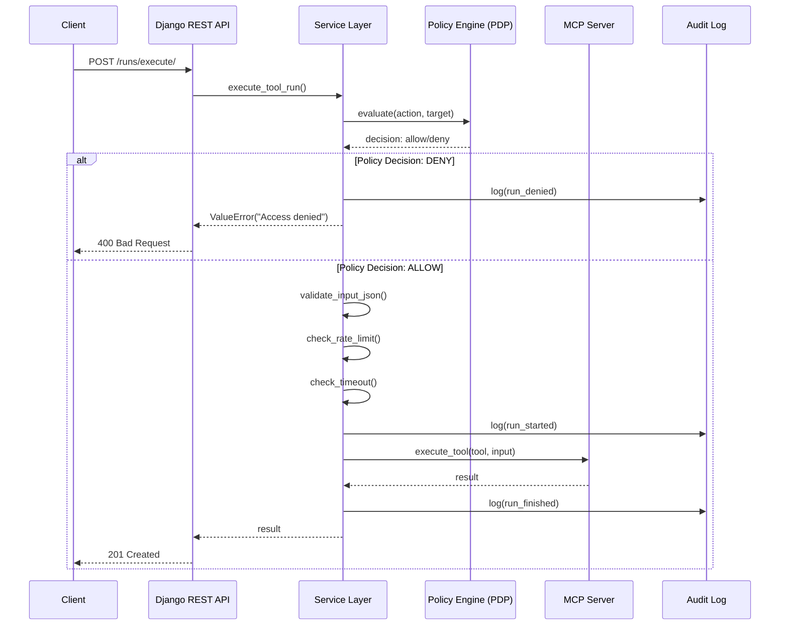
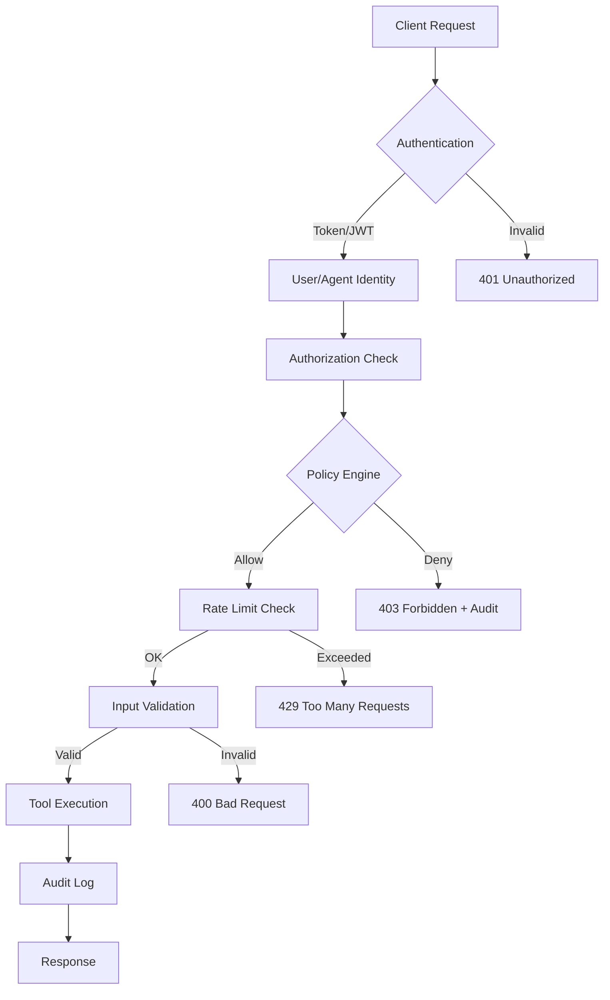

# 🏗️ AgentxSuite - Architektur-Visualisierung

## 📊 Entity-Relationship Diagram (Models)


## 🔌 API-Endpoints Übersicht

### 🔐 Authentication (`/api/v1/auth/`)

| Method | Endpoint | Description | Auth |
|--------|----------|-------------|------|
| `POST` | `/api/v1/auth/register/` | User registrieren | ❌ |
| `POST` | `/api/v1/auth/login/` | User login & Token erhalten | ❌ |
| `POST` | `/api/v1/auth/logout/` | User logout & Token löschen | ✅ |
| `GET` | `/api/v1/auth/me/` | Aktueller User & Organization | ✅ |
| `PUT/PATCH` | `/api/v1/auth/me/` | User Profil aktualisieren | ✅ |
| `GET` | `/api/v1/auth/me/orgs/` | User Organizations auflisten | ✅ |
| `POST` | `/api/v1/auth/me/orgs/` | User zu Organization hinzufügen | ✅ |

### 🏢 Organizations & Environments (`/api/v1/orgs/`)

| Method | Endpoint | Description | Auth |
|--------|----------|-------------|------|
| `GET` | `/api/v1/orgs/` | Organizations auflisten | ✅ |
| `POST` | `/api/v1/orgs/` | Organization erstellen | ✅ |
| `GET` | `/api/v1/orgs/{org_id}/` | Organization Details | ✅ |
| `PUT/PATCH` | `/api/v1/orgs/{org_id}/` | Organization aktualisieren | ✅ |
| `DELETE` | `/api/v1/orgs/{org_id}/` | Organization löschen | ✅ |
| `GET` | `/api/v1/orgs/{org_id}/environments/` | Environments auflisten | ✅ |
| `POST` | `/api/v1/orgs/{org_id}/environments/` | Environment erstellen | ✅ |
| `GET` | `/api/v1/orgs/{org_id}/environments/{env_id}/` | Environment Details | ✅ |
| `PUT/PATCH` | `/api/v1/orgs/{org_id}/environments/{env_id}/` | Environment aktualisieren | ✅ |
| `DELETE` | `/api/v1/orgs/{org_id}/environments/{env_id}/` | Environment löschen | ✅ |

### 🔗 Connections (`/api/v1/orgs/{org_id}/connections/`)

| Method | Endpoint | Description | Auth |
|--------|----------|-------------|------|
| `GET` | `/api/v1/orgs/{org_id}/connections/` | Connections auflisten | ✅ |
| `POST` | `/api/v1/orgs/{org_id}/connections/` | Connection erstellen | ✅ |
| `GET` | `/api/v1/orgs/{org_id}/connections/{id}/` | Connection Details | ✅ |
| `PUT/PATCH` | `/api/v1/orgs/{org_id}/connections/{id}/` | Connection aktualisieren | ✅ |
| `DELETE` | `/api/v1/orgs/{org_id}/connections/{id}/` | Connection löschen | ✅ |
| `POST` | `/api/v1/connections/{id}/test/` | Connection testen | ✅ |
| `POST` | `/api/v1/connections/{id}/sync/` | Tools von Connection synchronisieren | ✅ |
| `POST` | `/api/v1/orgs/{org_id}/connections/store-secret/` | Secret im SecretStore speichern | ✅ |

### 🤖 Agents (`/api/v1/orgs/{org_id}/agents/`)

| Method | Endpoint | Description | Auth |
|--------|----------|-------------|------|
| `GET` | `/api/v1/orgs/{org_id}/agents/` | Agents auflisten | ✅ |
| `POST` | `/api/v1/orgs/{org_id}/agents/` | Agent erstellen | ✅ |
| `GET` | `/api/v1/orgs/{org_id}/agents/{id}/` | Agent Details | ✅ |
| `PUT/PATCH` | `/api/v1/orgs/{org_id}/agents/{id}/` | Agent aktualisieren | ✅ |
| `DELETE` | `/api/v1/orgs/{org_id}/agents/{id}/` | Agent löschen | ✅ |
| `POST` | `/api/v1/orgs/{org_id}/agents/{id}/ping/` | Agent Status & Connection testen | ✅ |
| `GET` | `/api/v1/orgs/{org_id}/agents/{id}/tokens/` | Tokens auflisten | ✅ |
| `POST` | `/api/v1/orgs/{org_id}/agents/{id}/tokens/` | Token generieren | ✅ |
| `POST` | `/api/v1/orgs/{org_id}/agents/{id}/tokens/{jti}/revoke/` | Token widerrufen | ✅ |
| `DELETE` | `/api/v1/orgs/{org_id}/agents/{id}/tokens/{jti}/` | Token löschen (nur wenn revoked/expired) | ✅ |
| `POST` | `/api/v1/orgs/{org_id}/agents/create-axcore/` | AxCore-Agent vollständig erstellen | ✅ |

### 🛠️ Tools (`/api/v1/orgs/{org_id}/tools/`)

| Method | Endpoint | Description | Auth |
|--------|----------|-------------|------|
| `GET` | `/api/v1/orgs/{org_id}/tools/` | Tools auflisten | ✅ |
| `POST` | `/api/v1/orgs/{org_id}/tools/` | Tool erstellen | ✅ |
| `GET` | `/api/v1/orgs/{org_id}/tools/{id}/` | Tool Details | ✅ |
| `PUT/PATCH` | `/api/v1/orgs/{org_id}/tools/{id}/` | Tool aktualisieren | ✅ |
| `DELETE` | `/api/v1/orgs/{org_id}/tools/{id}/` | Tool löschen | ✅ |

### ▶️ Runs (`/api/v1/orgs/{org_id}/runs/`)

| Method | Endpoint | Description | Auth |
|--------|----------|-------------|------|
| `GET` | `/api/v1/orgs/{org_id}/runs/` | Runs auflisten | ✅ |
| `GET` | `/api/v1/orgs/{org_id}/runs/{id}/` | Run Details | ✅ |
| `GET` | `/api/v1/orgs/{org_id}/runs/{id}/steps/` | Run Steps auflisten | ✅ |
| `POST` | `/api/v1/orgs/{org_id}/runs/execute/` | **Unified Tool Execution** (empfohlen) | ✅ |

### 🔒 Policies (`/api/v1/orgs/{org_id}/policies/`)

| Method | Endpoint | Description | Auth |
|--------|----------|-------------|------|
| `GET` | `/api/v1/orgs/{org_id}/policies/` | Policies auflisten | ✅ |
| `POST` | `/api/v1/orgs/{org_id}/policies/` | Policy erstellen | ✅ |
| `GET` | `/api/v1/orgs/{org_id}/policies/{id}/` | Policy Details | ✅ |
| `PUT/PATCH` | `/api/v1/orgs/{org_id}/policies/{id}/` | Policy aktualisieren | ✅ |
| `DELETE` | `/api/v1/orgs/{org_id}/policies/{id}/` | Policy löschen | ✅ |
| `POST` | `/api/v1/orgs/{org_id}/policies/{id}/rules/` | Rule zu Policy hinzufügen | ✅ |
| `POST` | `/api/v1/orgs/{org_id}/policies/evaluate/` | Policy evaluieren | ✅ |
| `POST` | `/api/v1/policies/evaluate/` | Policy evaluieren (global) | ✅ |

#### Policy Rules (`/api/v1/policies/rules/`)

| Method | Endpoint | Description | Auth |
|--------|----------|-------------|------|
| `GET` | `/api/v1/policies/rules/` | Rules auflisten | ✅ |
| `POST` | `/api/v1/policies/rules/` | Rule erstellen | ✅ |
| `GET` | `/api/v1/policies/rules/{id}/` | Rule Details | ✅ |
| `PUT/PATCH` | `/api/v1/policies/rules/{id}/` | Rule aktualisieren | ✅ |
| `DELETE` | `/api/v1/policies/rules/{id}/` | Rule löschen | ✅ |

#### Policy Bindings (`/api/v1/policies/bindings/`)

| Method | Endpoint | Description | Auth |
|--------|----------|-------------|------|
| `GET` | `/api/v1/policies/bindings/` | Bindings auflisten | ✅ |
| `POST` | `/api/v1/policies/bindings/` | Binding erstellen | ✅ |
| `GET` | `/api/v1/policies/bindings/{id}/` | Binding Details | ✅ |
| `PUT/PATCH` | `/api/v1/policies/bindings/{id}/` | Binding aktualisieren | ✅ |
| `DELETE` | `/api/v1/policies/bindings/{id}/` | Binding löschen | ✅ |

### 🔍 Audit (`/api/v1/orgs/{org_id}/audit/`)

| Method | Endpoint | Description | Auth |
|--------|----------|-------------|------|
| `GET` | `/api/v1/orgs/{org_id}/audit/` | Audit Events auflisten (mit Filtern) | ✅ |
| `GET` | `/api/v1/orgs/{org_id}/audit/{id}/` | Audit Event Details | ✅ |
| `GET` | `/api/v1/audit/` | Global Audit Events (letzte 24h) | ✅ |

**Filter-Parameter:**
- `subject` - Filter nach Subject (Agent/User/Client)
- `action` - Filter nach Action (z.B. `tool.invoke`)
- `target` - Filter nach Target (z.B. `tool:pdf/read`)
- `decision` - Filter nach Decision (`allow`/`deny`)
- `ts_from` - Zeitfenster Start
- `ts_to` - Zeitfenster Ende

### 👤 Service Accounts (`/api/v1/orgs/{org_id}/service-accounts/`)

| Method | Endpoint | Description | Auth |
|--------|----------|-------------|------|
| `GET` | `/api/v1/orgs/{org_id}/service-accounts/` | Service Accounts auflisten | ✅ |
| `POST` | `/api/v1/orgs/{org_id}/service-accounts/` | Service Account erstellen | ✅ |
| `GET` | `/api/v1/orgs/{org_id}/service-accounts/{id}/` | Service Account Details | ✅ |
| `PUT/PATCH` | `/api/v1/orgs/{org_id}/service-accounts/{id}/` | Service Account aktualisieren | ✅ |
| `DELETE` | `/api/v1/orgs/{org_id}/service-accounts/{id}/` | Service Account löschen | ✅ |

### 🌐 MCP Extensions (`/api/v1/orgs/{org_id}/mcp/`)

| Method | Endpoint | Description | Auth |
|--------|----------|-------------|------|
| `GET` | `/api/v1/orgs/{org_id}/mcp/{env_id}/resources/` | MCP Resources auflisten | ✅ |
| `GET` | `/api/v1/orgs/{org_id}/mcp/{env_id}/resources/{uri}/` | MCP Resource Details | ✅ |
| `GET` | `/api/v1/orgs/{org_id}/mcp/{env_id}/prompts/` | MCP Prompts auflisten | ✅ |
| `GET` | `/api/v1/orgs/{org_id}/mcp/{env_id}/prompts/{name}/` | MCP Prompt Details | ✅ |

## 🔄 Datenfluss-Diagramm



## 🏛️ Architektur-Schichten

```
┌─────────────────────────────────────────────────────────┐
│                    Client Layer                          │
│  (Frontend, CLI, MCP Clients, External Services)        │
└────────────────────┬────────────────────────────────────┘
                     │
                     ▼
┌─────────────────────────────────────────────────────────┐
│                    API Layer (DRF)                       │
│  - ViewSets (CRUD)                                       │
│  - Serializers (Validation)                             │
│  - Authentication (Token/JWT)                           │
│  - Audit Logging Mixin                                  │
└────────────────────┬────────────────────────────────────┘
                     │
                     ▼
┌─────────────────────────────────────────────────────────┐
│                  Service Layer                           │
│  - Business Logic                                        │
│  - Policy Checks (PDP)                                   │
│  - Rate Limiting                                         │
│  - Timeout Management                                    │
│  - MCP Integration                                       │
│  - Secret Management                                     │
└────────────────────┬────────────────────────────────────┘
                     │
         ┌───────────┴───────────┐
         ▼                        ▼
┌──────────────────┐    ┌──────────────────┐
│   Model Layer    │    │  External APIs    │
│  - Django ORM    │    │  - MCP Servers    │
│  - Validations   │    │  - SecretStore    │
│  - Relationships │    │  - Redis (Rate)   │
└──────────────────┘    └──────────────────┘
```

## 🔐 Security Flow



## 📝 Wichtige Constraints & Validierungen

### Model Constraints

1. **Organization**
   - `name` ist unique

2. **Environment**
   - `(organization, name)` ist unique

3. **Connection**
   - `(organization, environment, name)` ist unique

4. **Tool**
   - `(organization, environment, name, version)` ist unique

5. **Agent**
   - `(organization, environment, name)` ist unique
   - `(organization, environment, slug)` ist unique (case-insensitive)
   - `RUNNER` mode erfordert `connection`
   - `BEARER` auth erfordert `bearer_secret_ref` oder `inbound_secret_ref`
   - `MTLS` auth erfordert `mtls_cert_ref` und `mtls_key_ref`

6. **Policy**
   - `(organization, name)` ist unique

7. **ServiceAccount**
   - `(organization, name)` ist unique
   - `(subject, issuer)` ist unique

8. **IssuedToken**
   - `jti` ist unique

### API Validierungen

- **Cross-Field Validation**: `environment.organization == organization` (in Serializers)
- **Policy Evaluation**: Vor jedem Tool-Run
- **JSON Schema Validation**: Tool Inputs werden gegen `schema_json` validiert
- **Rate Limiting**: Pro `agent_id + tool_id` (Redis Token Bucket)
- **Timeout**: Konfigurierbar pro Run (Standard: 30s)

## 🎯 Multi-Tenancy

Alle Ressourcen sind **organization-scoped**:
- URLs: `/api/v1/orgs/{org_id}/...`
- Models: `organization` + `environment` ForeignKeys
- Filtering: Automatisch nach `org_id` aus URL

**Ausnahmen:**
- `/api/v1/auth/` - User-spezifisch
- `/api/v1/policies/evaluate/` - Kann ohne `org_id` aufgerufen werden
- `/api/v1/audit/` - Global verfügbar (letzte 24h)

---

**Erstellt:** 2025-01-27  
**Version:** 1.0  
**Status:** Aktuell für AgentxSuite MVP

